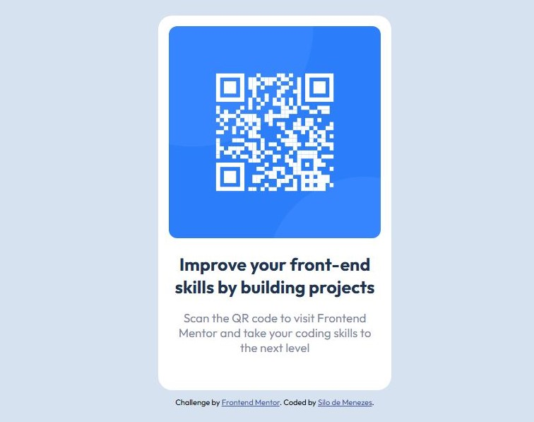

# Frontend Mentor - QR code component solution

Esta é a minha solução para o [desafio "QR code component" na plataforma Frontend Mentor](https://www.frontendmentor.io/challenges/qr-code-component-iux_sIO_H). Os desafios da Frontend Mentor ajudam você a melhorar suas habilidades de código ao construir projetos realistas.

## Tabela de conteúdo 

- [Overview](#overview)
  - [Screenshot](#screenshot)
  - [Links](#links)
- [Meu Processo](#meu-processo)
  - [Feito com:](#feito-com)
  - [O que eu aprendi](#coisas-que-aprendi-durante-este-desafio)
  - [Recursos Úteis](#recursos-úteis)
- [Autor](#autor)

## Overview

### Screenshot



### Links

- Solução URL: [Add solution URL here](https://your-solution-url.com)
- Live Site URL: [Add live site URL here](https://your-live-site-url.com)

## Meu processo

### Feito com:

- HTML5
- CSS
- [VSCode](https://code.visualstudio.com/)

### Coisas que aprendi durante este desafio

```html
<link rel="preconnect">

não conhecia o atributo "preconnect" até fazer este desafio. estou ansioso para usá-lo novamente no futuro
```
```md
me aprofundei mais na customização de Markdown ao fazer este "README"
```

### Recursos Úteis

- [Google Fonts](https://fonts.google.com/) - Forneceu a fonte usada no desafio que me permitiu deixar a versão final mais parecida com o design desejado no desafio.
- [Guia de Markdown](https://www.markdownguide.org/) - Eu não tinha uma boa noção de como preencher o README dos meus projetos antes de fazer este desafio. Esse guia me ajudou bastante nisso.

## Autor

- LinkedIn - [Silo de Menezes](www.linkedin.com/in/silo-menezes-648920197)
- Frontend Mentor - [@Silo30](https://www.frontendmentor.io/profile/Silo30)
- Github - [@Silo30](https://github.com/Silo30)
